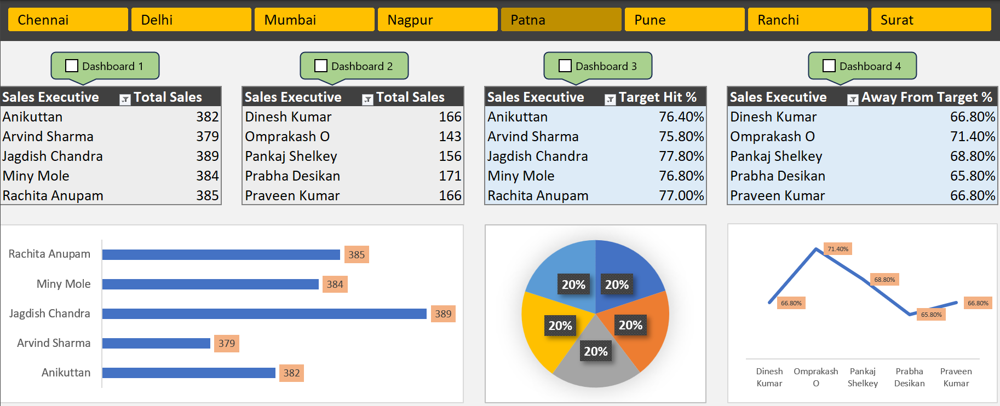
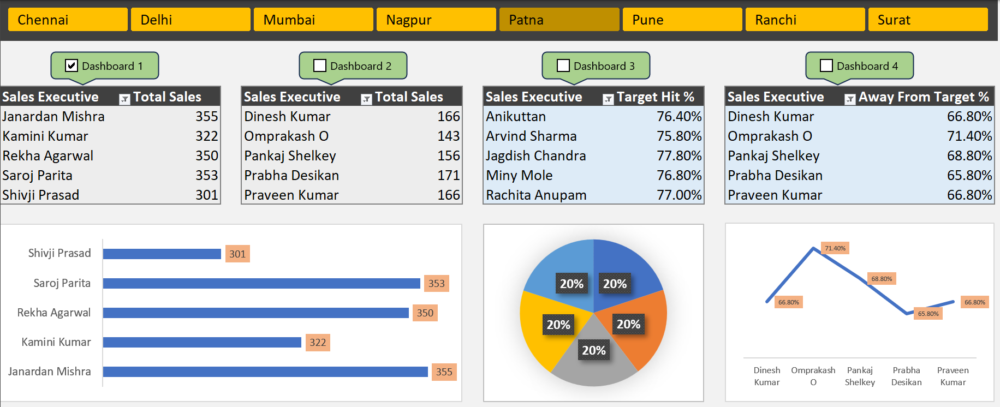
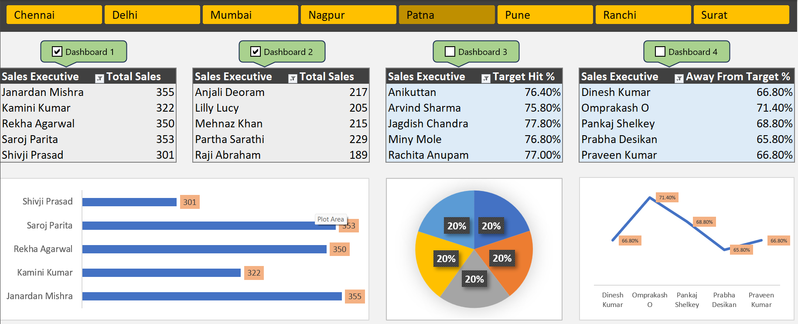
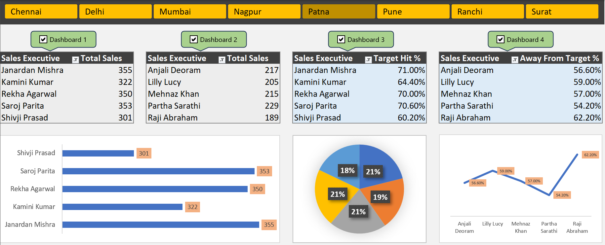

# Interactive Excel Sales Dashboard

## Overview

This project is an interactive sales dashboard built in **Microsoft Excel** using **Pivot Tables, Pivot Charts, Slicers, and VBA (Visual Basic for Applications)**. It helps analyze sales performance across different cities through an interactive dashboard with dynamic filtering and automated dashboard controls.

---

## Dashboard Preview

### Dashboard Overview



### Dashboard 1 – Total Sales



### Dashboard 2 – Sales Analysis



### Dashboard 3 – Target Hit %


### Dashboard 4 – Away From Target %



---

## Features

* Interactive Excel dashboard with a clean and user-friendly interface
* Interactive city-wise filtering using slicers
* Four dashboard sections for different sales metrics
* Dynamic Pivot Tables
* Pivot Charts for data visualization
* VBA Macro Automation
* Dashboard selection using checkboxes
* KPI visualization
* Sales executive performance tracking
* Target achievement analysis

---

## VBA Automation

The dashboard uses VBA macros to improve interactivity and usability.

The VBA module is responsible for:

* Automatically connecting and disconnecting Pivot Tables based on dashboard selection
* Enabling independent filtering for multiple dashboard sections
* Dynamically managing slicer connections
* Reducing manual configuration through automation
* Improving dashboard usability and overall performance

The VBA source code is available in the **VBA** folder (`Module1.bas`).

---

## Tools Used

* Microsoft Excel
* Pivot Tables
* Pivot Charts
* Slicers
* VBA (Visual Basic for Applications)

---

## Project Structure

```text
Excel-Dashboard/
│
├── Dashboard1.xlsm
├── README.md
├── images/
│   ├── dashboard-overview.png
│   ├── dashboard1-sales.png
│   ├── dashboard2-sales.png
│   ├── dashboard3-target-hit.png
│   └── dashboard4-away-target.png
│
└── VBA/
    └── Module1.bas
```

---

## How It Works

* Pivot Tables summarize the sales data.
* Pivot Charts provide interactive visualizations.
* Slicers allow users to filter dashboard data by city.
* VBA macros dynamically manage slicer connections, enabling each dashboard section to work independently.
* Dashboard values and charts update automatically based on user selections.

---

## Learning Outcome

While building this project, I gained practical experience in:

* Designing interactive dashboards in Microsoft Excel
* Working with Pivot Tables and Pivot Charts
* Using slicers for dynamic filtering
* Writing VBA macros for dashboard automation
* Creating business-oriented data visualizations

---

## Author

**Hrithik Doiphode**

GitHub: https://github.com/Hrithikdoi
