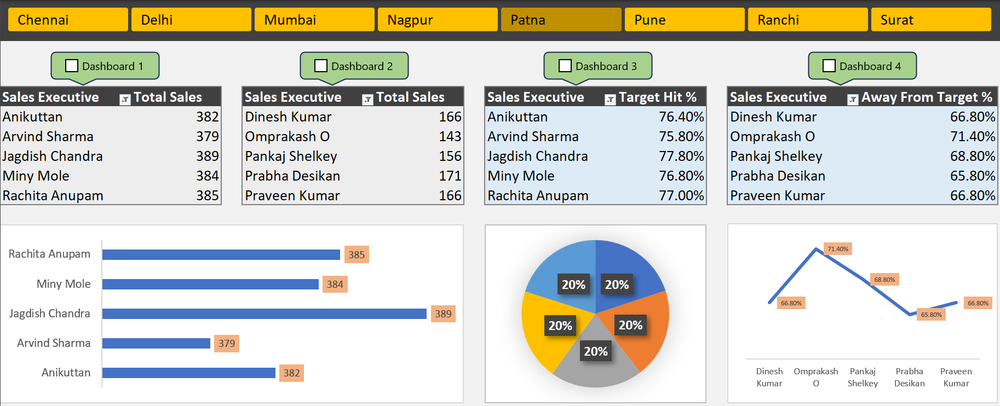

# Interactive Excel Sales Performance Dashboard

An interactive dashboard in Microsoft Excel that tracks sales executive performance against a fixed target across eight regions. It uses Pivot Tables, Pivot Charts, a region slicer, and a VBA macro that lets each of the four dashboard panels be switched on and filtered independently.

## Dashboard Preview



| Panel | What it shows |
|---|---|
| Dashboard 1 | Top 5 sales executives by total sales |
| Dashboard 2 | Bottom 5 sales executives by total sales |
| Dashboard 3 | Target Hit % of the top performers |
| Dashboard 4 | Away From Target % of the bottom performers |

Each panel has a checkbox. A checked panel responds to the region slicer at the top of the sheet, and an unchecked panel stays unfiltered.

## Dataset

- 141 sales executives across 8 regions: Chennai, Delhi, Mumbai, Nagpur, Patna, Pune, Ranchi and Surat
- Daily sales for 5 days (Day1 to Day5), plus Total Sales
- A fixed target of 500 for every executive
- Calculated columns: Target Hit % (Total Sales / Target) and Away From Target % (1 - Target Hit %)

## Key Findings

- **No executive reached the target of 500.** The highest total was 389 (Jagdish Chandra, Surat), which is 77.8% of target.
- **Only 17 of 141 executives (12%) reached 70% of target**, and 50 (35%) finished below 50%.
- **Nagpur had the best regional average** (291.6 sales per executive, 58.3% of target). **Ranchi had the lowest** (252.7, 50.5% of target).
- **Day 4 was the strongest sales day** (8,323 in total) and **Day 5 the weakest** (7,352).
- **The lowest total was 143** (Omprakash O, Mumbai), 28.6% of target.

## VBA Automation

`VBA/Module1.bas` contains the `SlicerConnection` macro. Each checkbox is linked to a cell on the sheet. The macro reads those cells and, for each panel, adds its Pivot Table to the region slicer when the box is checked and removes it when unchecked. This lets one slicer control any combination of the four panels.

## Tools Used

- Microsoft Excel
- Pivot Tables and Pivot Charts
- Slicers
- Form-control checkboxes
- VBA

## Repository Structure

```text
Excel-Dashboard/
├── Sales-Dashboard.xlsm
├── README.md
├── images/
│   ├── dashboard-overview.png
│   ├── dashboard1-sales.png
│   ├── dashboard2-sales.png
│   ├── dashboard3-target-hit.png
│   └── dashboard4-away-target.png
└── VBA/
    └── Module1.bas
```

## How to Use

1. Download `Sales-Dashboard.xlsm` and open it in desktop Excel.
2. Click **Enable Content** so the macro can run.
3. Tick the panels you want to filter, then click a region in the slicer.

## Author

**Hrithik Doiphode**

GitHub: https://github.com/Hrithikdoi
