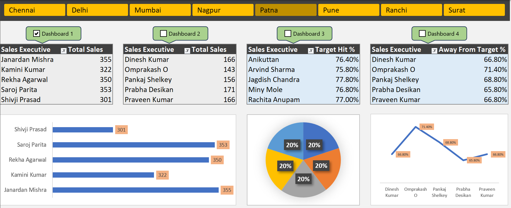
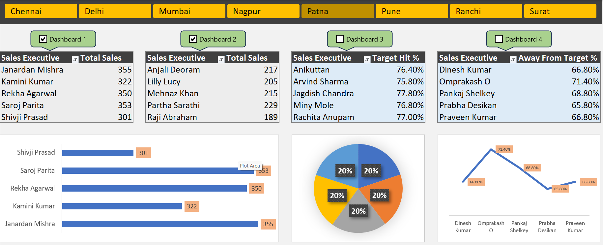
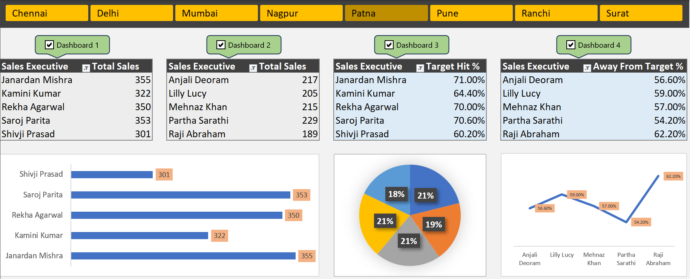

# Interactive Excel Sales Performance Dashboard

An Excel dashboard that tracks 141 sales executives against a fixed target of 500 across eight regions. It is built with Pivot Tables, Pivot Charts and a region slicer. A small VBA macro lets one slicer control any combination of the four dashboard panels, chosen with checkboxes.


## What the Dashboard Shows

| Panel | Table | Chart |
|---|---|---|
| Dashboard 1 | Top 5 executives by total sales | Bar chart of total sales |
| Dashboard 2 | Bottom 5 executives by total sales | Total sales table (no chart) |
| Dashboard 3 | Target Hit % of the Dashboard 1 executives | Pie chart |
| Dashboard 4 | Away From Target % of the Dashboard 2 executives | Line chart |

A checked panel responds to the region slicer at the top of the sheet. An unchecked panel ignores the slicer and shows all regions.

| Dashboard 1 (Patna) | Dashboard 1 + 2 (Patna) |
|---|---|
|  |  |

| Dashboard 1–3 (Patna) | All four panels (Patna) |
|---|---|
|  |  |

## Dataset

The `Data` sheet has 141 rows, one per sales executive.

| Column | Description |
|---|---|
| Emp Code, Sales Executive, Region | Identifier, name, and one of 8 regions: Chennai, Delhi, Mumbai, Nagpur, Patna, Pune, Ranchi, Surat |
| Day1 – Day5 | Sales for each of five days |
| Total Sales | Sum of Day1 to Day5 |
| Target | 500 for every executive |
| Target Hit % | Total Sales / Target |
| Away From Target % | 1 − Target Hit % |

## Key Findings

- **No executive reached the target of 500.** The highest total was 389 (Jagdish Chandra, Surat), or 77.8% of target.
- **Only 17 of 141 executives (12%) reached 70% of target**, and 50 (35%) finished below 50%.
- **Nagpur had the highest regional average** at 291.6 sales per executive (58.3% of target). **Ranchi had the lowest** at 252.7 (50.5%).
- **Day 4 was the strongest day** with 8,323 sales in total. **Day 5 was the weakest** with 7,352.
- **The lowest total was 143** (Omprakash O, Mumbai), or 28.6% of target.

## How the VBA Works

`VBA/Module1.bas` contains one macro, `SlicerConnection`. Each panel's checkbox is linked to a cell on `Sheet1` (A1, D1, G1 and J1). The macro reads those cells. For each panel it then does one of two things:

- If the box is checked, it adds that panel's Pivot Table to the `Slicer_Region` slicer cache.
- If the box is unchecked, it removes the Pivot Table from the slicer cache.

Because a slicer normally filters every Pivot Table connected to it, adding and removing connections is what lets each panel be switched on or off independently.

## Tools Used

- Microsoft Excel: Pivot Tables, Pivot Charts, Slicers
- Form-control checkboxes
- VBA

## Repository Structure

```text
Excel-Dashboard/
├── Sales-Dashboard.xlsm
├── README.md
├── images/
│   ├── dashboard-overview.png
│   ├── dashboard1-sales.png
│   ├── dashboard2-sales.png
│   ├── dashboard3-target-hit.png
│   └── dashboard4-away-target.png
└── VBA/
    └── Module1.bas
```

## How to Use

1. Download `Sales-Dashboard.xlsm` and open it in desktop Excel. The macros and slicer do not work in Excel for the web.
2. Click **Enable Content** so the macro can run.
3. Tick the panels you want to filter, then click a region in the slicer.

## Author

**Hrithik Doiphode**
GitHub: https://github.com/Hrithikdoi
